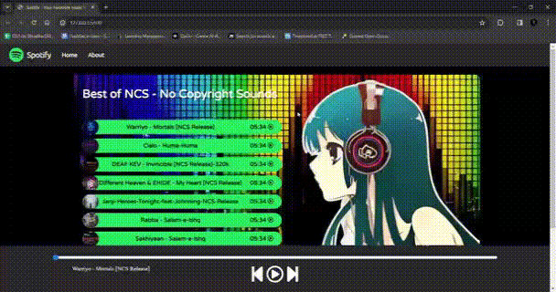
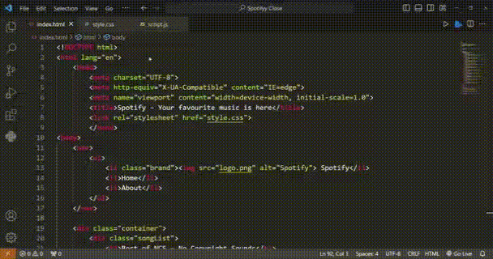

# Spotify-Clone-Page

## 🚀 Introduction

Welcome to the Spotify Clone! Immerse yourself in the world of music with this lightweight and dynamic clone, crafted entirely with HTML, CSS, and JavaScript.

## ✨ Features

- *Intuitive Music Player:* Seamlessly play your favorite tracks.
- *Playlist Management:* playlists with ease.
- *Responsive Design:* Enjoy a smooth experience on any device.

## 🛠 Technologies Used

- HTML
- CSS
- JavaScript
- 

## 🚀 Get Started

1. Clone the repository: git clone https://github.com/Sourav-Sir/Spotify-Clone-Page
2. Navigate to the project directory: cd Spotify-Clone-Page
3. Open index.html in your preferred browser.
